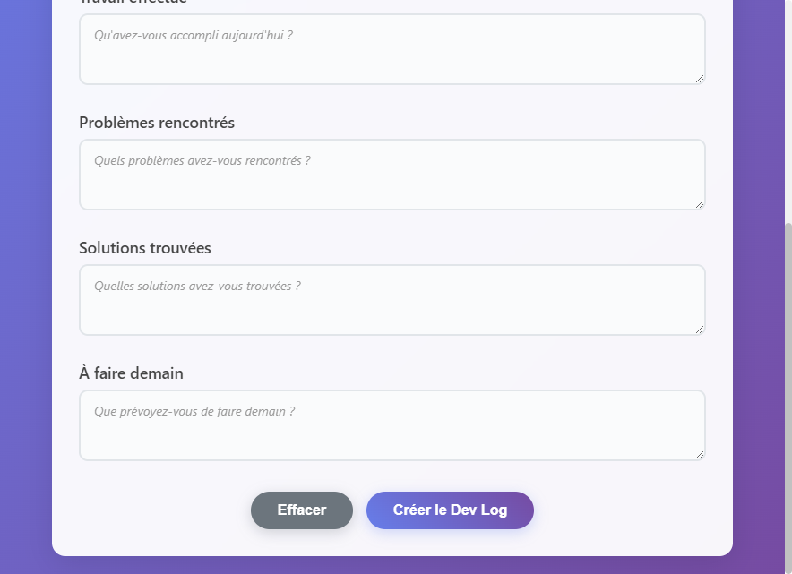
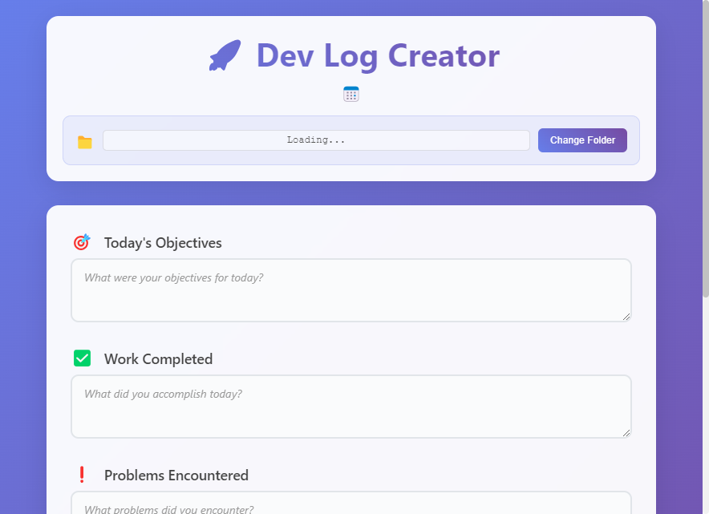
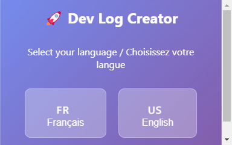

# Dev Log Creator

> Application desktop moderne pour créer vos dev logs quotidiens avec une interface graphique intuitive.


## Aperçu

### Interface principale (Français)


### Interface principale (English)


### Sélecteur de langue


## Fonctionnalités

- **Interface moderne** avec design gradient
- **Support bilingue** (Français/Anglais)
- **Sélecteur de dossier** personnalisé
- **5 champs structurés** pour votre journée
- **Création automatique** de la structure de dossiers
- **Sauvegarde des préférences**
- **Ouverture automatique** dans VS Code
- **Raccourcis clavier** (Ctrl+Enter, Ctrl+R)

## Installation

```bash
# Cloner le projet
git clone https://github.com/dpeterano/dev-log-creator.git
cd dev-log-creator

# Installer les dépendances
npm install
```

## Utilisation

### Interface graphique
```bash
npm start        # Interface française
npm run start-en # Interface anglaise
```

### Exécutables pré-compilés
```bash
# Windows - Version française
.\Lancer-Version-Francaise.bat

# Windows - Version anglaise
.\Launch-English-Version.bat
```

### Mode console (ancien)
```bash
npm run console  # Interface en ligne de commande
```

## Structure générée

```
[Votre Dossier]/
└── dev-log/
    └── 2025/
        └── 07/
            └── 2025-07-28.md
```

## Template généré

```markdown
# Dev Log - 2025-07-28

## Objectifs du jour
- Vos objectifs ici

## Travail effectué  
- Ce que vous avez accompli

## Problèmes rencontrés
- Difficultés rencontrées

## Solutions trouvées
- Solutions apportées

## À faire demain
- Plans pour demain

## Notes
- Notes supplémentaires
```

## Développement

```bash
# Mode développement (avec DevTools)
npm run dev        # Français
npm run dev-en     # Anglais

# Construire l'exécutable
npm run pack       # Version française
npm run pack-en    # Version anglaise
```

## Raccourcis

- **Ctrl + Enter** : Créer le dev log
- **Ctrl + R** : Effacer tous les champs

## Support linguistique

- **Français** : Version par défaut
- **English** : Fonctionnalités complètes

## License

MIT - Voir [LICENSE](LICENSE) pour plus de détails.

---

**Ce projet vous aide ?** N'hésitez pas à lui donner une étoile !

## 📦 Générer un fichier .exe

Pour créer un fichier exécutable Windows :

```bash
# Générer la version française (portable)
npm run pack

# Générer la version anglaise (portable) 
npm run pack-en

# Générer les deux versions
npm run pack && npm run pack-en
```

### 🚀 Raccourcis de lancement rapide

- **`Lancer-Version-Francaise.bat`** - Lance la version française
- **`Launch-English-Version.bat`** - Lance la version anglaise

Les exécutables se trouvent dans le dossier `build/` :

## 🌍 Support multilingue

- **Français** (par défaut): `npm start`
- **English**: `npm run start-en`
- **Sélecteur de langue**: `npm run select-language`

L'exécutable sera créé dans le dossier `dist/` :
- `dist/Dev Log Creator Setup 1.0.0.exe` - Installateur
- `dist/win-unpacked/` - Version portable

## 🎨 Interface

L'application présente une interface moderne avec :
- **Design gradient** bleu/violet
- **Champs auto-redimensionnables**
- **Animations fluides**
- **Notifications en temps réel**
- **Boutons avec effets hover**

## 📁 Structure générée

L'application crée maintenant la structure suivante dans le dossier de votre choix :

```
[Dossier sélectionné]/
└── dev-log/
    └── 2025/
        └── 07/
            └── 2025-07-28.md
```

### 🔧 Configuration personnalisée

- **Première utilisation** : Le dossier par défaut est `Documents/dev-log`
- **Changement de dossier** : Cliquez sur "Changer le dossier" dans l'interface
- **Sauvegarde automatique** : Vos préférences sont sauvegardées dans `~/.dev-log-creator-settings.json`

Contenu du fichier généré :
```markdown
# Dev Log - 2025-07-28

## Objectifs du jour
- [Vos objectifs]

## Travail effectué
- [Votre travail]

## Problèmes rencontrés
- [Vos problèmes]

## Solutions trouvées
- [Vos solutions]

## À faire demain
- [Vos plans]

## Notes
- 
```

## 🎮 Raccourcis clavier

- **Ctrl + Enter** : Créer le dev log
- **Ctrl + R** : Effacer tous les champs
- **Tab** : Navigation entre les champs

---

*Créé avec ❤️ par Dylan*
