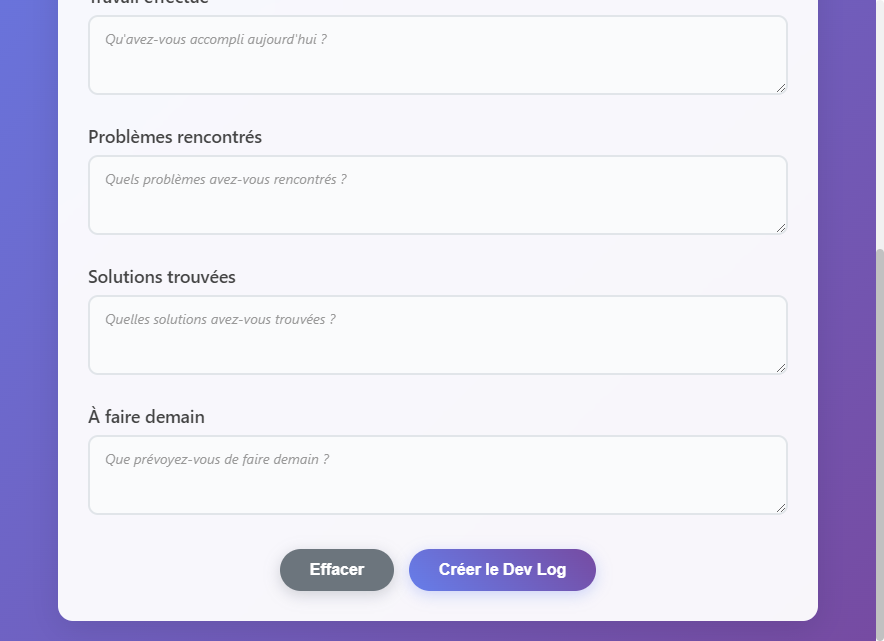

# 🚀 Dev Log Creator

> Modern desktop application to create daily dev logs with an intuitive graphical interface.


## 📸 Screenshots

### Main Interface (French)


### Main Interface (English)


### Language Selector


## ✨ Features

- 🎨 **Modern interface** with gradient design
- 🌍 **Bilingual support** (French/English)
- 📁 **Custom folder selector**
- 📝 **5 structured fields** for your day
- 🔄 **Automatic folder structure** creation
- 💾 **Settings persistence**
- 🚀 **Automatic VS Code integration**
- ⌨️ **Keyboard shortcuts** (Ctrl+Enter, Ctrl+R)

## 🚀 Quick Start

```bash
# Clone the project
git clone https://github.com/dpeterano/dev-log-creator.git
cd dev-log-creator

# Install dependencies
npm install

# Launch the application
npm start                # French version
npm run start-en         # English version
npm run select-language  # Language selector
```

## 📱 Usage

### GUI Application
```bash
npm start        # French interface
npm run start-en # English interface
```

### Pre-built Executables
```bash
# Windows - French version
.\Lancer-Version-Francaise.bat

# Windows - English version  
.\Launch-English-Version.bat
```

### Console Mode (Legacy)
```bash
npm run console  # Command line interface
```

## 📂 Generated Structure

```
[Your Folder]/
└── dev-log/
    └── 2025/
        └── 07/
            └── 2025-07-28.md
```

## 📝 Generated Template

```markdown
# Dev Log - 2025-07-28

## Today's Objectives
- Your objectives here

## Work Completed
- What you accomplished

## Problems Encountered
- Issues you faced

## Solutions Found
- How you solved them

## Tomorrow's Tasks
- Your plans for tomorrow

## Notes
- Additional notes
```

## 🛠️ Development

```bash
# Development mode (with DevTools)
npm run dev     # French
npm run dev-en  # English

# Build executables
npm run pack    # French version
npm run pack-en # English version
```

## ⌨️ Keyboard Shortcuts

- **Ctrl + Enter**: Create dev log
- **Ctrl + R**: Clear all fields

## 🌍 Language Support

- **Français** (French): Default version
- **English**: Full feature parity

## � License

MIT - See [LICENSE](LICENSE) for details.

---

⭐ **Found this helpful?** Give it a star on GitHub!

```bash
# Install electron-builder globally (optional)
npm install -g electron-builder

# Build for Windows
npm run build-win

# Build English version for Windows
npm run build-win-en
```

## 🌍 Language Support

- **French** (default): `npm start`
- **English**: `npm run start-en`

## 🛠️ Development

```bash
# Development mode with DevTools (French)
npm run dev

# Development mode with DevTools (English)
npm run dev-en
```

## 📁 Generated Structure

The application now creates the following structure in your chosen folder:

```
[Selected Folder]/
└── dev-log/
    ├── 2025/
    │   ├── 01/
    │   │   ├── 2025-01-15.md
    │   │   └── 2025-01-16.md
    │   └── 02/
    │       └── 2025-02-01.md
```

### 🔧 Custom Configuration

- **First use**: Default folder is `Documents/dev-log`
- **Change folder**: Click "Change Folder" in the interface
- **Auto-save**: Your preferences are saved in `~/.dev-log-creator-settings.json`

## 🚀 Quick Start

1. Clone the repository
2. Run `npm install`
3. Run `npm start` (French) or `npm run start-en` (English)
4. Fill in your daily log and click "Create Dev Log"
5. The file opens automatically in VS Code

## 📝 Dev Log Template

Each generated file contains:

```markdown
# Dev Log - YYYY-MM-DD

## Today's Objectives
- Your objectives here

## Work Completed
- What you accomplished

## Problems Encountered
- Issues you faced

## Solutions Found
- How you solved them

## Tomorrow's Tasks
- Your plans for tomorrow

## Notes
- Additional notes
```

## ⌨️ Keyboard Shortcuts

- **Ctrl+Enter**: Create dev log
- **Ctrl+R**: Clear all fields

## 🤝 Contributing

Contributions are welcome! Please feel free to submit a Pull Request.

## 📄 License

This project is licensed under the MIT License - see the [LICENSE](LICENSE) file for details.

## 👤 Author

**Dylan**

---

⭐ If this project helped you, please give it a star on GitHub!
